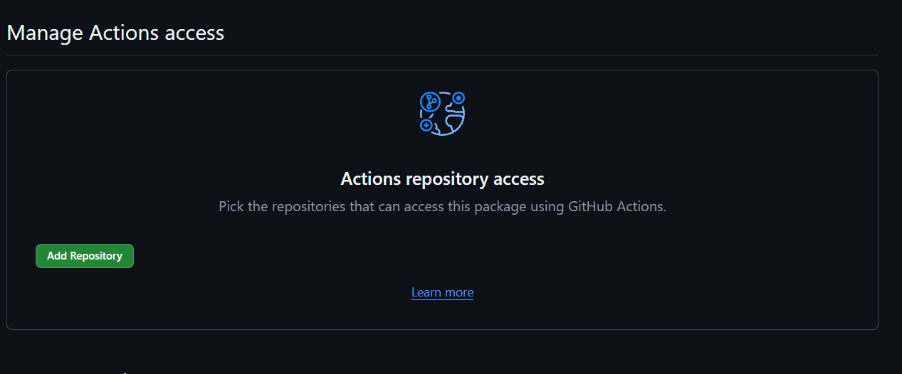
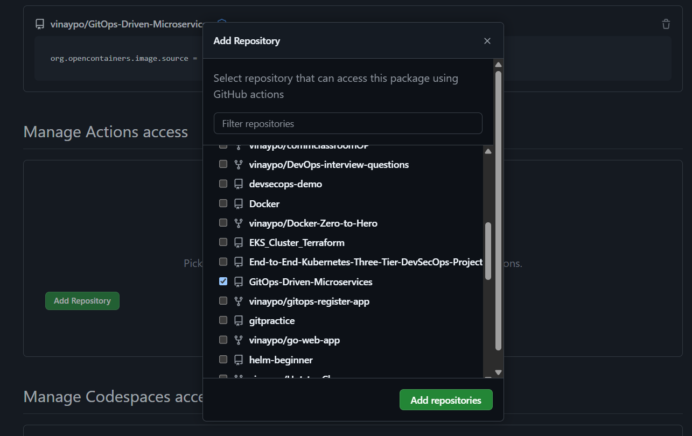
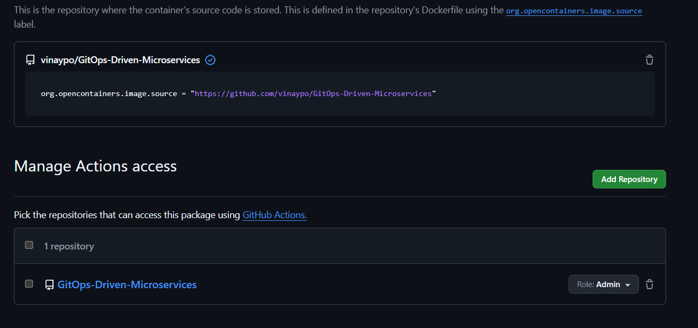
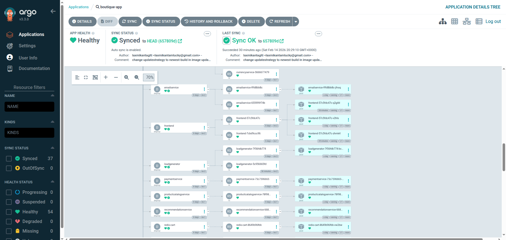
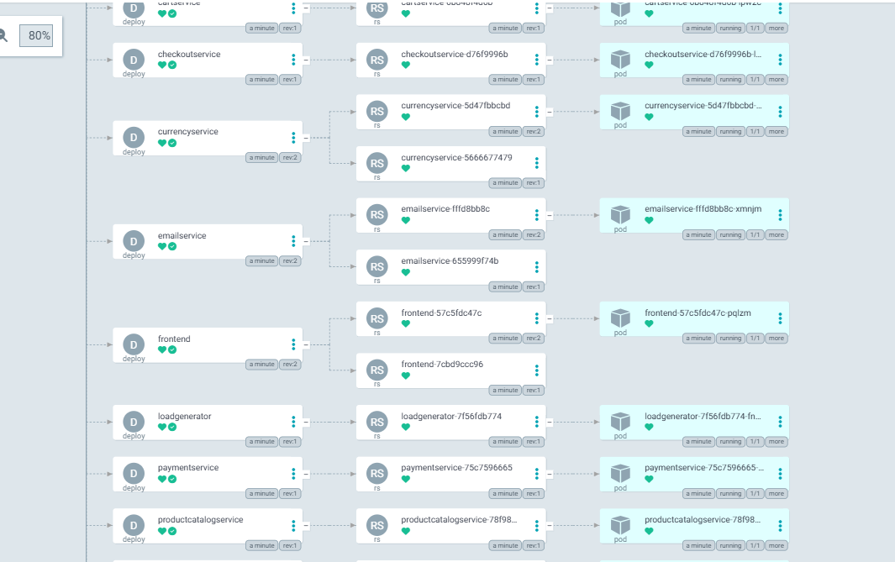
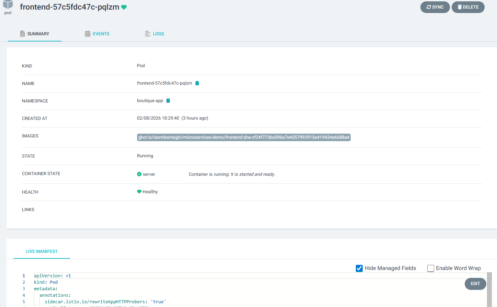

# Project Introduction


# Intro to Online Boutique App


This is a type of e-commerce platform, but unlike Amazon-type stores, it focuses on:


- **Niche or curated products**

- **Unique / limited collections**

- **Strong brand identity & style**


Think of it as a **digital version of a small, stylish fashion store**.


But from a **technical perspective**, modern boutique apps are **not built as a single application**.


They are built using **Microservices Architecture**.

[!TIP]
# What is Microservices?

**Microservices** is an architectural style where an application is broken into **small, independent services**, and each service:

- Handles a **specific business function**
- Runs independently
- Communicates via APIs

👉 Instead of one big application (monolith), you have **multiple small services working together**.

---

# Online Boutique = Microservices in Action

This online boutique app is made up of multiple services like:

### 🧾 Product Catalog Service

- Manages product list, categories, pricing

### 🛒 Cart Service

- Handles user cart (add/remove items)

### 💳 Payment Service

- Processes payments (UPI, cards)

### 📦 Order Service

- Manages order lifecycle

### 👤 Frontend Service

- Authentication & profiles

### 🚚 Shipping Service

- Delivery tracking & logistics

### Etc..

---

# How These Services Communicate

- REST APIs (HTTP)
- gRPC (faster internal communication)
- Message queues (Kafka / RabbitMQ)

👉 Example:

- Cart service → calls Product service
- Order service → calls Payment service

---

# Monolith vs Microservices

### Monolithic App ❌

- Everything in one codebase
- Hard to scale
- Single failure affects whole system

### Microservices App ✅

- Independent services
- Easy to scale
- Fault isolation

👉 That’s why modern apps (like boutique apps) >use microservices.


# **Architecture**


**Online Boutique** is composed of 11 microservices written in different languages that talk to each other over gRPC.


| **Service** | **Language** | **Description** |

| --- | --- | --- |

| [frontend](https://github.com/vinaypo/GitOps-Driven-Microservices/tree/main/src/frontend) | Go | Exposes an HTTP server to serve the website. Handles user sessions and displays product catalog. |

| [cartservice](https://github.com/vinaypo/GitOps-Driven-Microservices/tree/main/src/cartservice) | C# | Stores the items in the user's shopping cart in Redis. Manages add/remove/view cart operations. |

| [productcatalogservice](https://github.com/vinaypo/GitOps-Driven-Microservices/tree/main/src/productcatalogservice) | Go | Provides the list of products from a JSON file. Returns product details, pricing, and inventory. |

| [currencyservice](https://github.com/vinaypo/GitOps-Driven-Microservices/tree/main/src/currencyservice) | Node.js | Converts one money amount to another currency. Provides real-time exchange rate conversions. |

| [paymentservice](https://github.com/vinaypo/GitOps-Driven-Microservices/tree/main/src/paymentservice) | Node.js | Charges the given credit card info (mock implementation). Simulates payment processing without real transactions. |

| [shippingservice](https://github.com/vinaypo/GitOps-Driven-Microservices/tree/main/src/shippingservice) | Go | Gives shipping cost estimates based on shopping cart contents and destination. Calculates delivery logistics. |

| [emailservice](https://github.com/vinaypo/GitOps-Driven-Microservices/tree/main/src/emailservice) | Python | Sends users an order confirmation email (mock implementation). Logs email delivery attempts. |

| [checkoutservice](https://github.com/vinaypo/GitOps-Driven-Microservices/tree/main/src/checkoutservice) | Go | Retrieves user cart, prepares order and orchestrates payment, shipping and notification services. |

| [recommendationservice](https://github.com/vinaypo/GitOps-Driven-Microservices/tree/main/src/recommendationservice) | Python | Recommends other products based on user browsing and shopping history. Provides personalized suggestions. |

| [adservice](https://github.com/vinaypo/GitOps-Driven-Microservices/tree/main/src/adservice) | Java | Provides text ads based on given context words. Returns relevant advertisements for product pages. |

| [loadgenerator](https://github.com/vinaypo/GitOps-Driven-Microservices/tree/main/src/loadgenerator) | Python/Locust | Continuously sends requests imitating realistic user behavior. Generates synthetic traffic for testing. |


Screenshots:


---


**Most services are stateless**, and **only the cart uses persistence (Redis)**. Let's break it down cleanly.


# How data works in `microservices`


This project is **designed** to:


- Demonstrate **microservice communication**

- Be **easy to deploy anywhere**

- Avoid complex database ops


So it uses **minimal persistence** on purpose.


---


## Service-by-Service Data Breakdown


### ✅ **cartservice** → ✔️ HAS persistence


**Storage used:**


- **Redis**


**What's stored:**


- User cart items

- Quantity, product IDs


**Why Redis?**


- Fast

- Simple

- Easy to reset

- No schema complexity


📌 In Kubernetes:


- Redis runs as a pod (or StatefulSet)

- Cart data is lost if Redis is deleted (by default)


---


### ❌ **orders / checkout** → NO real database


There is **NO dedicated "orders database"**.


**checkoutservice:**


- Aggregates data from:

    - cartservice

    - paymentservice

    - shippingservice

    - emailservice

- Simulates order placement

- Does **not persist orders**


👉 This is **by design**, to keep the demo lightweight.


---


### ❌ **productcatalogservice**


**Storage:**


- Static JSON file

- Loaded into memory at startup


**No DB**


- Products reset on restart


---


### ❌ **recommendationservice**


**Storage:**


- Stateless

- Generates recommendations dynamically


---


### ❌ **paymentservice**


**Storage:**


- None

- Fake payment processor


---


### ❌ **shippingservice**


**Storage:**


- None

- Simulated shipping cost logic


---


### ❌ **emailservice**


**Storage:**


- None

- Just logs "email sent"


---


### ❌ **adservice**


**Storage:**


- In-memory ad data

- No persistence


---


### ❌ **frontend**


**Storage:**


- Stateless

- Just UI + API calls


---


### ❌ **currencyservice**


**Storage:**


- Static exchange rates

- In-memory only


---


## SUMMARY TABLE


| **Service** | **Persistent Storage** | **Type** | **Language** |

| --- | --- | --- | --- |

| [cartservice](https://github.com/vinaypo/GitOps-Driven-Microservices/tree/main/src/cartservice) | ✅ Yes | Redis | C# |

| [checkoutservice](https://github.com/vinaypo/GitOps-Driven-Microservices/tree/main/src/checkoutservice) | ❌ No | Stateless | Go |

| [productcatalogservice](https://github.com/vinaypo/GitOps-Driven-Microservices/tree/main/src/productcatalogservice) | ❌ No | In-memory JSON | Go |

| [recommendationservice](https://github.com/vinaypo/GitOps-Driven-Microservices/tree/main/src/recommendationservice) | ❌ No | Stateless | Python |

| [paymentservice](https://github.com/vinaypo/GitOps-Driven-Microservices/tree/main/src/paymentservice) | ❌ No | Fake | Node.js |

| [shippingservice](https://github.com/vinaypo/GitOps-Driven-Microservices/tree/main/src/shippingservice) | ❌ No | Fake | Go |

| [emailservice](https://github.com/vinaypo/GitOps-Driven-Microservices/tree/main/src/emailservice) | ❌ No | Fake | Python |

| [adservice](https://github.com/vinaypo/GitOps-Driven-Microservices/tree/main/src/adservice) | ❌ No | In-memory | Java |

| [frontend](https://github.com/vinaypo/GitOps-Driven-Microservices/tree/main/src/frontend) | ❌ No | Stateless | Go |

| [currencyservice](https://github.com/vinaypo/GitOps-Driven-Microservices/tree/main/src/currencyservice) | ❌ No | In-memory | Node.js |

| [loadgenerator](https://github.com/vinaypo/GitOps-Driven-Microservices/tree/main/src/loadgenerator) | ❌ No | Stateless | Python/Locust |


---


"The demo intentionally keeps most services stateless to simplify deployment and focus on platform concerns like CI/CD, observability, scaling, and networking."
 


---


# Project Architecture


---
---

# Building and Pushing the docker images to GHCR (GitHub Container Registry)

<details>

<summary>Click to get the steps</summary>

### Step-1: Create the token
Create a PAT classic token with the below permissions.

Give permissions:

```
Packages → Read&Write
```

If private repo add the below as well:

```
Contents →Read
```

### Step-2: Login to GHCR to push the docker images

```bash
echo <TOKEN> | docker login ghcr.io -u USERNAME --password-stdin
```

### Step-3: Build the docker image by using the dockerfile in the particular folder

```
docker build -t ghcr.io/vinaypo/microservices/adservice:v0.10.4 adservice/
```

### step-4: Push the docker image to the ghcr repository

```
docker push ghcr.io/vinaypo/microservices/adservice:v0.10.4
```

## Once we have the images in the github packages, connect them to the repository.

Click on the profile, go to the packages --> package settings --> add the repository & give the role:"admin or write or read".

- read: Can download the package and read package metadata
- write: Can download the package and do both read and write package metadata
- admin: Can upload, download, manage, read, write package metadata and delete, restore packages.

Manage Actions access to which you want to give the package access


Select the repository and give the right Role.



</details>

---
---

# How to create the helm package and store it in the GHCR ?

<details>

<summary>Click to get the steps</summary>

### Step-1: Create the token
Create a PAT classic token with the below permissions.

Give permissions:

```
Packages → Read&Write
```

If private repo add the below as well:

```
Contents →Read
```

### Step-2: Login via Helm

```bash
echo <TOKEN> | helm registry login ghcr.io -u USERNAME --password-stdin
```

If Successful:

```
Login Succeeded
```

## What Your Chart Path Will Look Like

OCI format:

```
oci://ghcr.io/<OWNER>/charts/onlineboutique
```

Example:

```
oci://ghcr.io/vinaypo/charts/onlineboutique
```

Do:

```
helm package .
```

You will see the package will get created with ```.tgz``` format

```
Vinay@LAPTOP-422D1LR6 MINGW64 /d/Devops_Projects/project/Microservices-Project/GitOps-Driven-Microservices/helm-chart (main)
$ ls
Chart.yaml  README.md  onlineboutique-0.10.4.tgz  templates/  values.yaml
```

Push to the repository:

```
helm push onlineboutique-0.10.4.tgz oci://ghcr.io/vinaypo
```

Now you can directly install the package using the below command
(Make sure its public)

```
helm install boutique oci://ghcr.io/vinaypo/onlineboutique --version 0.10.4
```

Initially, the Helm chart was structured as a single monolithic repository, without separation for individual microservices. To improve modularity and enable an efficient CI/CD workflow, I pulled the official Docker images for each service and stored them in GitHub Container Registry. I then updated the Helm templates to reference these images, packaged the chart, and pushed it to GitHub Container Registry. This setup ensures a streamlined and scalable CI/CD process tailored to our microservices architecture.

Once you have the images in the github packages, connect them to the repository.

</details>

---
---

## Now Lets set up the CI part in Github Action.

As the permission is set now. We will add the workflow files now.

Create a directory at the root level of the repo.

```
mkdir -p .github/workflows
```
Inside the workflows create two config file.

#### Note: These files are already available in the github repo. You just need to modify them and use them as per your need.

```microservice-ci.yaml:```

```
name: Microservice CI

on:
  workflow_call:
    inputs:
      service:
        required: true
        type: string

jobs:
  build:
    runs-on: ubuntu-latest
    env:
      IMAGE_NAME: ghcr.io/${{ github.repository_owner }}/microservices/${{ inputs.service }}:sha-${{ github.sha }}

    steps:
      # -------------------
      # Checkout source
      # -------------------
      - name: Checkout code
        uses: actions/checkout@v6

      # -------------------
      # Docker Buildx (cache support)
      # -------------------
      - name: Set up Docker Buildx
        uses: docker/setup-buildx-action@v4

      # -------------------
      # Login to GHCR
      # -------------------
      - name: Login to GHCR
        uses: docker/login-action@v4
        with:
          registry: ghcr.io
          username: ${{ github.actor }}
          password: ${{ secrets.GITHUB_TOKEN }}

      # -------------------
      # Build Docker image (cached)
      # -------------------
      - name: Build Image
        run: |
          docker build \
            --cache-from=type=gha \
            --cache-to=type=gha,mode=max \
            -t $IMAGE_NAME \
            ./src/${{ inputs.service }}

      # -------------------
      # Security Scan (before push)
      # -------------------
      - name: Run Trivy Scan
        uses: aquasecurity/trivy-action@v0.20.0
        with:
          scan-type: image
          image-ref: ${{ env.IMAGE_NAME }}
          severity: HIGH,CRITICAL
          exit-code: 0
          vuln-type: os,library

      # -------------------
      # Push image (only if scan passes)
      # -------------------
      - name: Push Image
        run: |
          docker push $IMAGE_NAME
```
[!TIP]

### In the trivy scan part:
The exit-code is set to 0 intentionally just to pass the build. But its recommended to set to it 1. so that -

-  If ANY HIGH or CRITICAL vulnerability is found → fail the pipeline immediately.
-  This is actually best practice for financial / security-heavy companies.

#### Note: You will get the scan report whether its set to 0 or 1.

```ci-trigger.yaml:```

```
name: Microservices Trigger CI

on:
  push:
    branches: [main]
    paths:
      - "src/**"

permissions:
  contents: read
  packages: write
  attestations: write
  id-token: write

jobs:
  # -------------------------------
  # Job 1: Detect changed services
  # -------------------------------
  detect-changes:
    runs-on: ubuntu-latest
    outputs:
      services: ${{ steps.changed.outputs.services }}

    steps:
      - name: Checkout repo
        uses: actions/checkout@v6
        with:
          fetch-depth: 0

      - name: Detect changed services
        id: changed
        run: |
          SERVICES=$(git diff --name-only ${{ github.event.before }} ${{ github.sha }} \
            | grep '^src/' \
            | cut -d'/' -f2 \
            | sort -u \
            | jq -R -s -c 'split("\n")[:-1]')

          echo "Detected services: $SERVICES"
          echo "services=$SERVICES" >> $GITHUB_OUTPUT

  # --------------------------------------------------
  # Job 2: Call reusable workflow (matrix per service)
  # --------------------------------------------------
  build-and-push:
    needs: detect-changes
    if: needs.detect-changes.outputs.services != '[]'

    strategy:
      fail-fast: false
      matrix:
        service: ${{ fromJson(needs.detect-changes.outputs.services) }}

    # IMPORTANT:
    # Reusable workflows are called at JOB level
    uses: ./.github/workflows/microservice-ci.yaml

    with:
      service: ${{ matrix.service }}
    secrets: inherit
```

## Now Lets Move to the CD part.

To make the CD part work in GitOps way. First we need to have setup the argocd.

Our application code , helm chart and Helm values are already in the repo.

Additionally to expose our application via Gateway API we need httproute and targetgroupconfiguration files which you can keep in the separate directory in the root.

In our case i kept in ```microservices-extra-kube-manifests/``` folder in the root directory.

-  Create target group configurations for the app frontend service.

    ```microservices-extra-kube-manifests/target-grp.yaml```

    ```
        #target group configuration
        apiVersion: gateway.k8s.aws/v1beta1
        kind: TargetGroupConfiguration
        metadata:
            name: app-tg-config
            namespace: boutique-app
        spec:
            targetReference:
                name: frontend
            defaultConfiguration:
                targetType: ip 
    ```

-  Create the HTTProute for the app so that it will get attached with the gateway and add as a listener in the load balancer.

    ```microservices-extra-kube-manifests/HTTProute.yaml```

    ```
        apiVersion: gateway.networking.k8s.io/v1beta1
        kind: HTTPRoute
        metadata:
        name: http-app-route
        namespace: boutique-app
        spec:
        hostnames:
            - "boutique.thedevopsnow.online"
        parentRefs:
        - group: gateway.networking.k8s.io
            namespace: default
            kind: Gateway
            name: app-alb-gateway
            sectionName: http
        - group: gateway.networking.k8s.io
            namespace: default
            kind: Gateway
            name: app-alb-gateway
            sectionName: https
        rules:
        - backendRefs:
            - name: frontend
            port: 80
    ```
- ArgoCD can deploy multiple sources from one repo inside a single Application using ```Kustomize.```

- Kustomize render it as a single manifest file.

So first Lets create kustomization config and we will attach that as source.

## Why This Is The Best Pattern

Because you get:

### ✔ Helm remains reusable
You can publish it later.

### ✔ Infra-specific resources stay outside
HTTPRoute, TargetGroupBinding are environment-specific, not app-specific.

### ✔ Cleaner GitOps

Separation of concerns.

Think like this:

👉 Helm = Application

👉 Extra manifests = Platform / Networking layer

[!Important]

You do NOT need to install Kustomize in the cluster.

👉 Argo CD has built-in support for Kustomize.

It renders Kustomize manifests internally inside the Argo CD repo-server before applying them to the cluster.

Create a kustomize config file

- Do NOT apply this file manually
- You commit this file to Git.
- Then ArgoCD does everything.

```kustomization.yaml``` (Root Dir)

    ```
    apiVersion: kustomize.config.k8s.io/v1beta1
    kind: Kustomization

    resources:
    - microservices-extra-kube-manifests/HTTProute.yaml
    - microservices-extra-kube-manifests/target-grp.yaml

    helmCharts:
    - name: onlineboutique
        repo: oci://ghcr.io/vinaypo
        version: 0.10.4
        releaseName: boutique-app
        namespace: boutique-app
        valuesFile: helm-chart/values.yaml
    ```

[!TIP]

## What Actually Happens Behind the Scenes

When you create an Argo CD Application that points to a Kustomize directory:

1. Argo CD repo-server clones your Git repo.
2. It detects kustomization.yaml.
3. Runs something equivalent to kustomize build .
4. Sends the rendered manifests to the Kubernetes API.
👉 All of this happens inside the Argo CD pod, not your cluster nodes.

## Create our Argocd App

Create the argo app manifest and place it inside the ```argocd/argocd-apps``` directory for organise better.

```boutique-app.yaml```

    ```
    apiVersion: argoproj.io/v1alpha1
    kind: Application
    metadata:
    name: boutique-app
    namespace: argocd
    spec:
    project: default

    source:
        repoURL: https://github.com/vinaypo/GitOps-Driven-Microservices.git
        targetRevision: HEAD
        path: .

    destination:
        server: https://kubernetes.default.svc
        namespace: boutique-app

    syncPolicy:
        automated:
        prune: true
        selfHeal: true
        syncOptions:
        - CreateNamespace=true
    ```

Now apply the file:

``` 
kubectl apply -f boutique-app.yaml
```

Check the ArgoCD UI you should see the app visible there. And all Synced.



---
---

# Now Lets integrate the CI with CD

In the current setup the CD (ArgoCD) never takes the updated image form the CI. We need an image updater here, which we have already setup during infrastructure setup.

The image updater pods will be looking like this as shown below:
Make sure its running:
```
kubectl get po -n argocd

NAME                                                        READY   STATUS    RESTARTS   AGE
argo-cd-argocd-application-controller-0                     1/1     Running   0          3h22m
argo-cd-argocd-applicationset-controller-769bdb7567-cxhtp   1/1     Running   0          23h
argo-cd-argocd-dex-server-86768bcd44-jtlf7                  1/1     Running   0          23h
argo-cd-argocd-notifications-controller-8b76b5d6f-wsflw     1/1     Running   0          23h
argo-cd-argocd-redis-5bfc9f9dc7-v76tt                       1/1     Running   0          23h
argo-cd-argocd-repo-server-6d684f8f65-z6vgx                 1/1     Running   0          175m
argo-cd-argocd-server-d5cb45b88-pcxfg                       1/1     Running   0          3h22m
argocd-image-updater-controller-684b4bd5f9-5w6xf            1/1     Running   0          34s
```

## Argo CD Image Updater – GitHub & Secret Requirements
Argo CD Image Updater can work in two different modes:

- Live-state update (Argo CD API mode)
- Git write-back mode (true GitOps)
The secrets and permissions required depend on the mode you choose.

## Current Setup: ImageUpdater CRD + newest-build (NO Git write-back)

### What we are using ?
- ImageUpdater CRD
- updateStrategy: newest-build
- No writeBack.method: git
- Images updated via Argo CD API
- Helm values updated in live state only

The CI pipeline automatically builds and pushes images to the container registry. The ArgoCD Image Updater continuously monitors the registry and, upon detecting a new image tag, directly updates the live application resources in the cluster using the ArgoCD API. This eliminates the need to manually update Helm values or commit changes to Git, providing a simple and automated deployment flow suitable for personal projects.

### Flow

```
CI pushesimage → GHCR
       ↓
ImageUpdater detects newestimage
       ↓
ImageUpdater patches Argo CD Application (K8s API)
       ↓
Argo CD deploys newimage
```
### As of now it's using the base older version of image
```
#currently using the the older version of the image "v0.10.4"
kubectl describe po frontend-7dd5db5f5-xb7g8 -n boutique-app | grep "image"

Normal  Pulled     51m   kubelet            spec.containers{server}: Container image "ghcr.io/vinaypo/microservices/frontend:v0.10.4" already present on machine
```

Add ```imageupdater``` CR

```argocd/image-updater.yaml```

```
apiVersion: argocd-image-updater.argoproj.io/v1alpha1
kind: ImageUpdater
metadata:
  name: boutique-image-updater
  namespace: argocd
spec:
  namespace: argocd
  applicationRefs:
    - namePattern: "boutique-*"

      commonUpdateSettings:
        updateStrategy: "newest-build"
        allowTags: "regexp:^sha-[a-f0-9]{7,40}$"

      images:
        - alias: adservice
          imageName: ghcr.io/vinaypo/microservices/adservice

        - alias: cartservice
          imageName: ghcr.io/vinaypo/microservices/cartservice

        - alias: checkoutservice
          imageName: ghcr.io/vinaypo/microservices/checkoutservice

        - alias: currencyservice
          imageName: ghcr.io/vinaypo/microservices/currencyservice

        - alias: emailservice
          imageName: ghcr.io/vinaypo/microservices/emailservice

        - alias: frontend
          imageName: ghcr.io/vinaypo/microservices/frontend

        - alias: paymentservice
          imageName: ghcr.io/vinaypo/microservices/paymentservice

        - alias: productcatalogservice
          imageName: ghcr.io/vinaypo/microservices/productcatalogservice

        - alias: recommendationservice
          imageName: ghcr.io/vinaypo/microservices/recommendationservice

        - alias: shippingservice
          imageName: ghcr.io/vinaypo/microservices/shippingservice

        - alias: loadgenerator
          imageName: ghcr.io/vinaypo/microservices/loadgenerator
```

Apply it:

```
kubectl apply -f argocd/image-updater.yaml
```

Verify:

```
kubectl get imageupdater -n argocd

NAME                     AGE
boutique-image-updater   13s
```
Head to ArgoCD UI , and in separte tab run the CI pipeline or trigger it via chnaging the code you should see updated images automaticaaly picked. in ArgoCD





