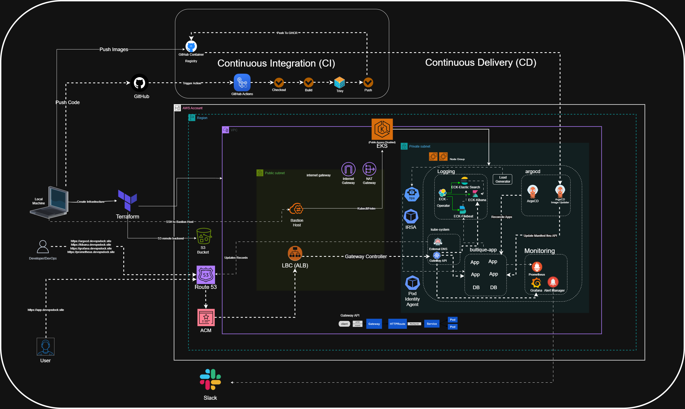
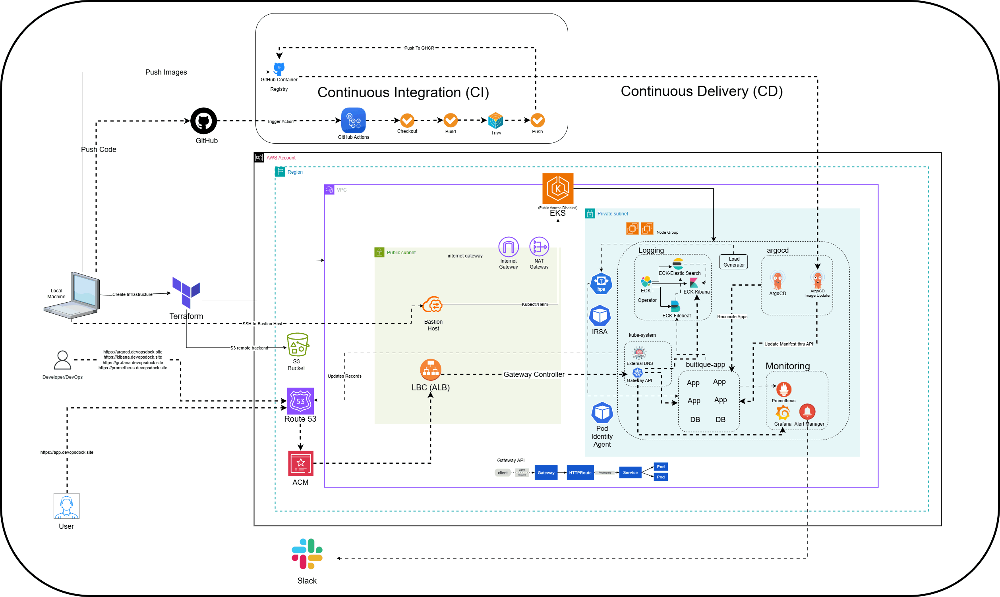

# Project Introduction

# Intro to Online Boutique App

This is a type of e-commerce platform, but unlike Amazon-type stores, it focuses on:

- **Niche or curated products**

- **Unique / limited collections**

- **Strong brand identity & style**

Think of it as a **digital version of a small, stylish fashion store**.

But from a **technical perspective**, modern boutique apps are **not built as a single application**.

They are built using **Microservices Architecture**.

> [!TIP]

># What is Microservices?

>

>**Microservices** is an architectural style where an application is broken into **small, independent services**, and each service:

>

>- Handles a **specific business function**

>- Runs independently

>- Communicates via APIs

>

>👉 Instead of one big application (monolith), you have **multiple small services working together**.

>

>---

>

># Online Boutique = Microservices in Action

>

>This online boutique app is made up of multiple services like:

>

>### 🧾 Product Catalog Service

>

>- Manages product list, categories, pricing

>

>### 🛒 Cart Service

>

>- Handles user cart (add/remove items)

>

>### 💳 Payment Service

>

>- Processes payments (UPI, cards)

>

>### 📦 Order Service

>

>- Manages order lifecycle

>

>### 👤 Frontend Service

>

>- Authentication & profiles

>

>### 🚚 Shipping Service

>

>- Delivery tracking & logistics

>

>### Etc..

>

>---

>

># How These Services Communicate

>

>- REST APIs (HTTP)

>- gRPC (faster internal communication)

>- Message queues (Kafka / RabbitMQ)

>

>👉 Example:

>

>- Cart service → calls Product service

>- Order service → calls Payment service

>

>---

>

># Monolith vs Microservices

>

>### Monolithic App ❌

>

>- Everything in one codebase

>- Hard to scale

>- Single failure affects whole system

>

>### Microservices App ✅

>

>- Independent services

>- Easy to scale

>- Fault isolation

>

>👉 That's why modern apps (like boutique apps) use microservices.

# **Architecture**

**Online Boutique** is composed of 11 microservices written in different languages that talk to each other over gRPC.

| **Service** | **Language** | **Description** |

| --- | --- | --- |

| [frontend](https://github.com/vinaypo/GitOps-Driven-Microservices/tree/main/src/frontend) | Go | Exposes an HTTP server to serve the website. Does not require si[...] |

| [cartservice](https://github.com/vinaypo/GitOps-Driven-Microservices/tree/main/src/cartservice) | C# | Stores the items in the user's shopping cart in Redis and [...] |

| [productcatalogservice](https://github.com/vinaypo/GitOps-Driven-Microservices/tree/main/src/productcatalogservice) | Go | Provides the list of products from a J[...] |

| [currencyservice](https://github.com/vinaypo/GitOps-Driven-Microservices/tree/main/src/currencyservice) | Node.js | Converts one money amount to another currency[...] |

| [paymentservice](https://github.com/vinaypo/GitOps-Driven-Microservices/tree/main/src/paymentservice) | Node.js | Charges the given credit card info (mock) with [...] |

| [shippingservice](https://github.com/vinaypo/GitOps-Driven-Microservices/tree/main/src/shippingservice) | Go | Gives shipping cost estimates based on the shoppin[...] |

| [emailservice](https://github.com/vinaypo/GitOps-Driven-Microservices/tree/main/src/emailservice) | Python | Sends users an order confirmation email (mock). |

| [checkoutservice](https://github.com/vinaypo/GitOps-Driven-Microservices/tree/main/src/checkoutservice) | Go | Retrieves user cart, prepares order and orchestrat[...] |

| [recommendationservice](https://github.com/vinaypo/GitOps-Driven-Microservices/tree/main/src/recommendationservice) | Python | Recommends other products based on[...] |

| [adservice](https://github.com/vinaypo/GitOps-Driven-Microservices/tree/main/src/adservice) | Java | Provides text ads based on given context words. |

| [loadgenerator](https://github.com/vinaypo/GitOps-Driven-Microservices/tree/main/src/loadgenerator) | Python/Locust | Continuously sends requests imitating reali[...] |

Screenshots:

---

**Most services are stateless**, and **only the cart uses persistence (Redis)**. Let's break it down cleanly.

# How data works in `microservices-demo`

This project is **designed** to:

- Demonstrate **microservice communication**

- Be **easy to deploy anywhere**

- Avoid complex database ops

So it uses **minimal persistence** on purpose.

---

## Service-by-Service Data Breakdown

### ✅ **cartservice** → ✔️ HAS persistence

**Storage used:**

- **Redis**

**What's stored:**

- User cart items

- Quantity, product IDs

**Why Redis?**

- Fast

- Simple

- Easy to reset

- No schema complexity

📌 In Kubernetes:

- Redis runs as a pod (or StatefulSet)

- Cart data is lost if Redis is deleted (by default)

---

### ❌ **orders / checkout** → NO real database

There is **NO dedicated "orders database"**.

**checkoutservice:**

- Aggregates data from:

    - cartservice

    - paymentservice

    - shippingservice

    - emailservice

- Simulates order placement

- Does **not persist orders**

👉 This is **by design**, to keep the demo lightweight.

---

### ❌ **productcatalogservice**

**Storage:**

- Static JSON file

- Loaded into memory at startup

**No DB**

- Products reset on restart

---

### ❌ **recommendationservice**

**Storage:**

- Stateless

- Generates recommendations dynamically

---

### ❌ **paymentservice**

**Storage:**

- None

- Fake payment processor

---

### ❌ **shippingservice**

**Storage:**

- None

- Simulated shipping cost logic

---

### ❌ **emailservice**

**Storage:**

- None

- Just logs "email sent"

---

### ❌ **adservice**

**Storage:**

- In-memory ad data

- No persistence

---

### ❌ **frontend**

**Storage:**

- Stateless

- Just UI + API calls

---

### ❌ **currencyservice**

**Storage:**

- Static exchange rates

- In-memory only

---

## SUMMARY TABLE

| Service | Persistent Storage | Type |

| --- | --- | --- |

| cartservice | ✅ Yes | Redis |

| checkoutservice | ❌ No | Stateless |

| productcatalogservice | ❌ No | In-memory JSON |

| recommendationservice | ❌ No | Stateless |

| paymentservice | ❌ No | Fake |

| shippingservice | ❌ No | Fake |

| emailservice | ❌ No | Fake |

| adservice | ❌ No | In-memory |

| frontend | ❌ No | Stateless |

| currencyservice | ❌ No | In-memory |

| loadgenerator | ❌ No | Stateless |

---

> "The demo intentionally keeps most services stateless to simplify deployment and focus on platform concerns like CI/CD, observability, scaling, and networking."

> 

---

# Project Architecture

